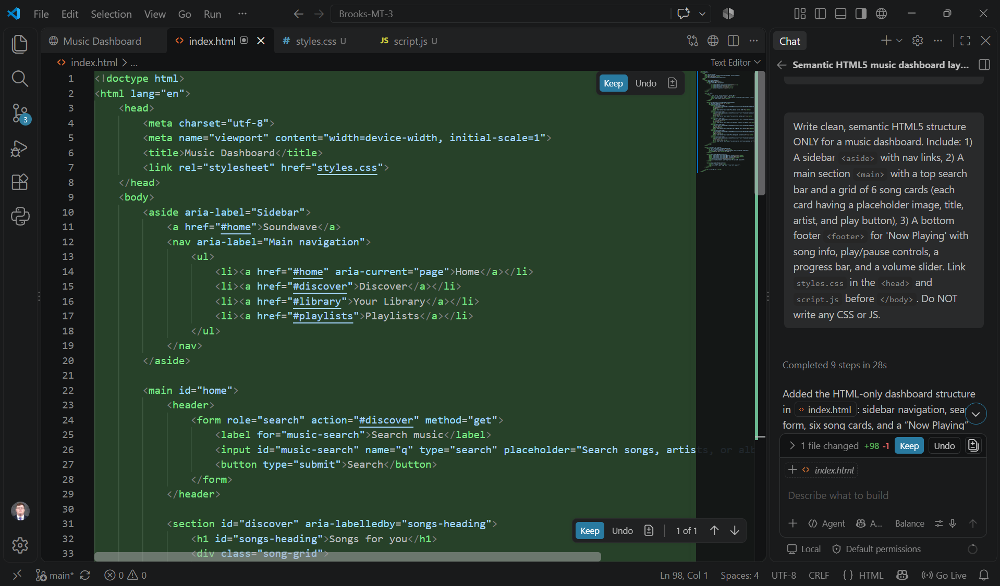
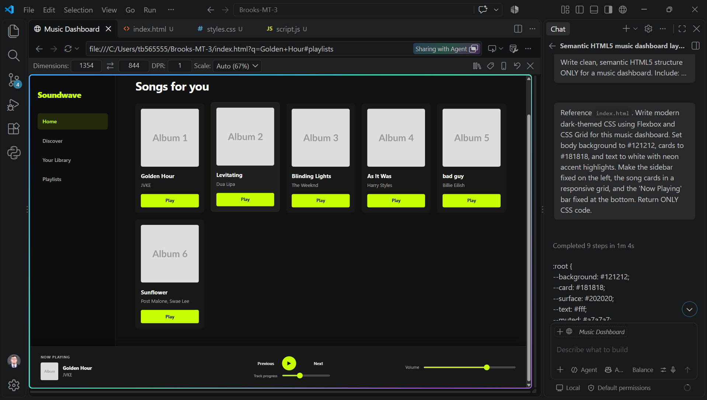
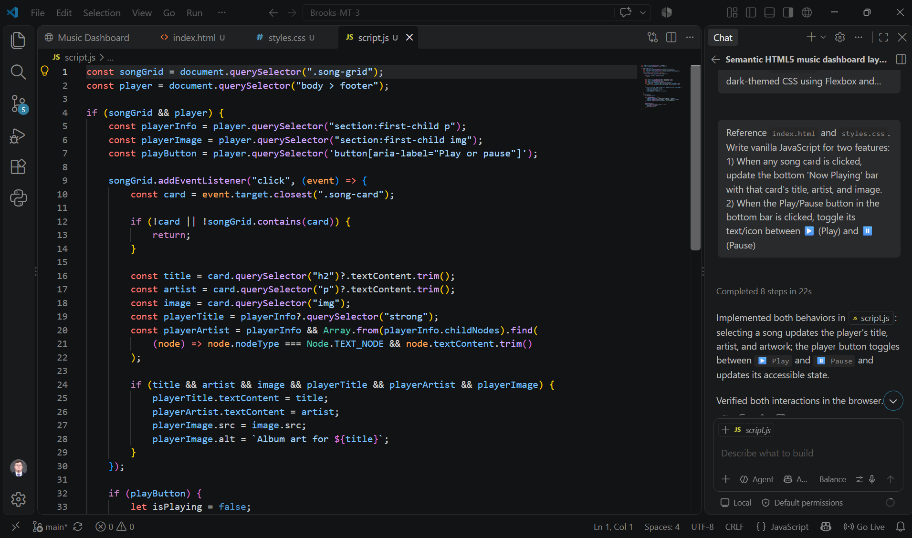
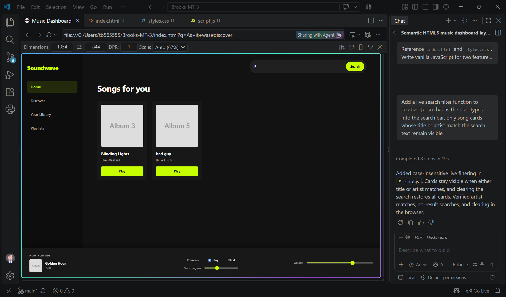
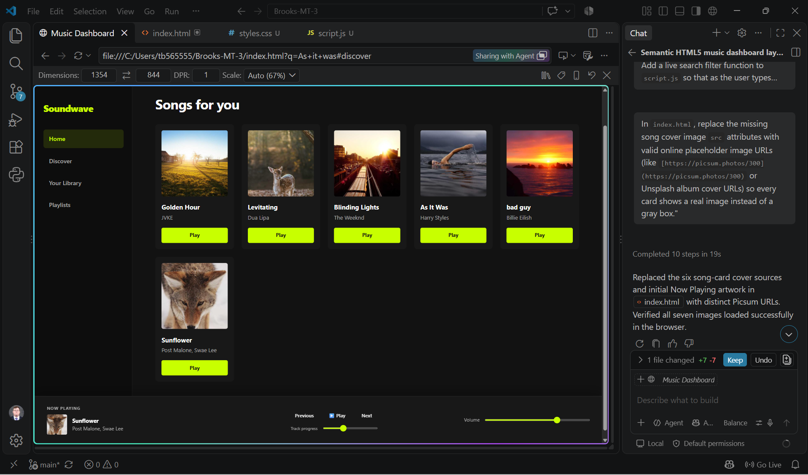
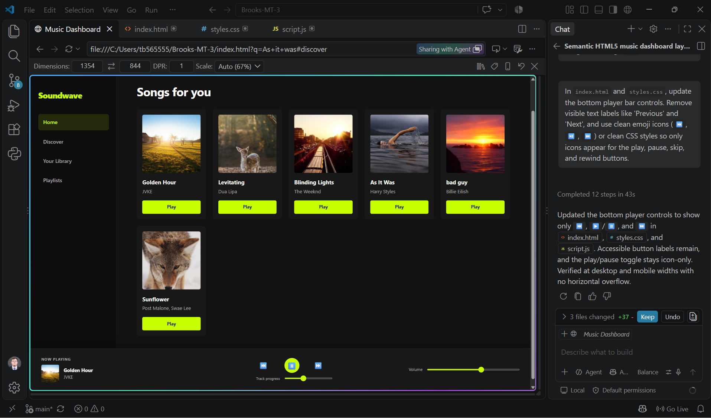
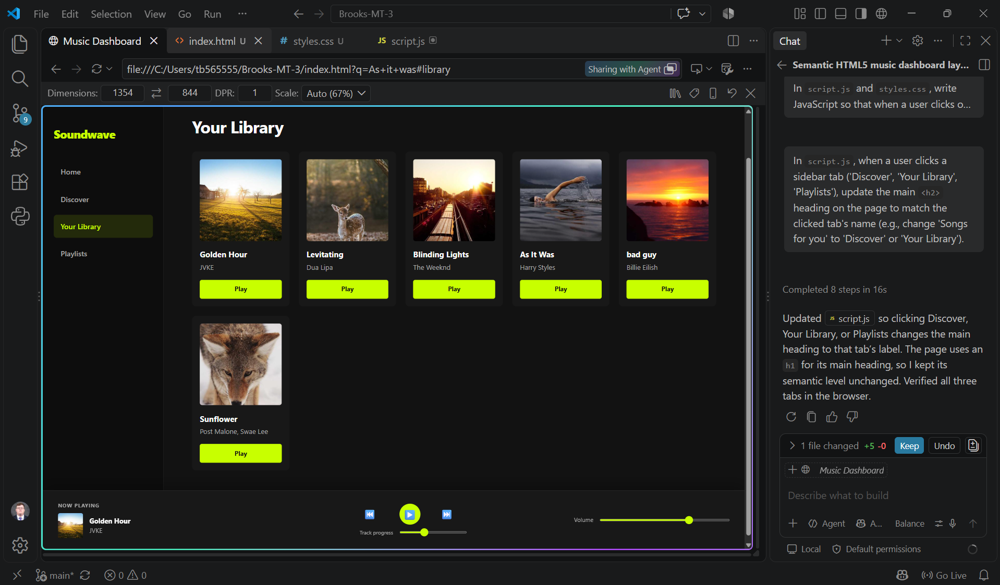

# Assignment Reflection: Building with GitHub Copilot

---

## Question 1: What did you ask Copilot to help you build? How did you break down the problem?

I used GitHub Copilot to build a modern, dark-themed music player which was essentially a spotify clone. To keep the project simple and easy to manage, I broke the build down into small, step-by-step pieces:

1. **HTML Layout:** Building the main skeleton of the page, including a sidebar, a search bar at the top, a grid for song cards, and a bottom bar for the music player.
2. **CSS Styling:** Adding styles to create a dark theme with neon colors, setting up a card grid layout, and pinning the player bar to the bottom of the screen.
3. **JavaScript Features:** Writing scripts so that clicking a song updates the bottom player bar with that song's name, artist, and picture, as well as making the play/pause button work.
4. **Fixing Bugs:** Fixing issues with sidebar tabs highlighting, fixing missing cover images, and making sure the top search bar stayed in view when switching tabs.

---

## Question 2: How did your approach to asking questions change as you worked?

My prompting strategy changed a lot from the beginning to the end of the project:

- **Starting Too Big:** When I started, I asked Copilot to write the HTML, CSS, and JavaScript all at once in a single prompt. This created messy code with inline styles that didn't work well together.
- **Moving Step-by-Step:** I learned to clear the workspace and ask Copilot for one file at a time (`index.html`, then `styles.css`, then `script.js`). 
- **Being Specific:** Instead of asking for general features, I started giving Copilot exact details—like asking it to prevent the page from auto-scrolling by using `scrollTop = 0` when tabs were clicked.

---

## Question 3: What parts of the development process with GitHub Copilot surprised you?

A few things about working with Copilot really surprised me:

- **It Reads Other Files:** Copilot was able to read my `index.html` file when I was working in `styles.css`, so it knew the exact names of my classes without me having to type them out again.
- **Fast Styling:** It instantly generated a great-looking dark theme with nice background colors and layout grids without me having to manually look up color codes.
- **Quick Bug Fixes:** When clicking a sidebar tab caused the page to scroll past the top search bar, Copilot was able to understand the issue and give me a quick JavaScript fix.

---

## Question 4: What did you learn about the technology you used that you didn't know before?

Working with GitHub Copilot taught me several important lessons about how AI development assistants actually work:

- **AI Needs Context to Work Well:** I learned that Copilot relies heavily on open tabs and clear naming conventions. If my HTML elements were named vaguely, Copilot gave generic answers, but when my code was structured clearly, it could accurately predict what CSS or JavaScript I needed.
- **AI Is Better at Incremental Steps Than Big Picture Tasks:** Asking Copilot to build an entire app at once failed, but asking it to write a single function or style a single component worked exceptionally well.
- **AI Can Debug Behavior, Not Just Syntax:** I learned that Copilot isn't just for writing initial code—it can also help explain and fix logical issues, like preventing the page from scrolling when clicking tab links.

---

## Question 5: What would you do differently if you had to build this again?

If I had to build this application over again, I would:

1. **Set Up Files First:** Create the empty files and plan out the names of elements before asking Copilot to generate code.
2. **Use Inline Chat:** Use `Ctrl + I` directly inside the code editor more often, rather than only using the side chat panel.
3. **Use a Song Data Array:** Store all song details in a single list (an array of objects) in JavaScript from the start to make filtering and dynamic updates even easier.

## More photos from the debugging process:

